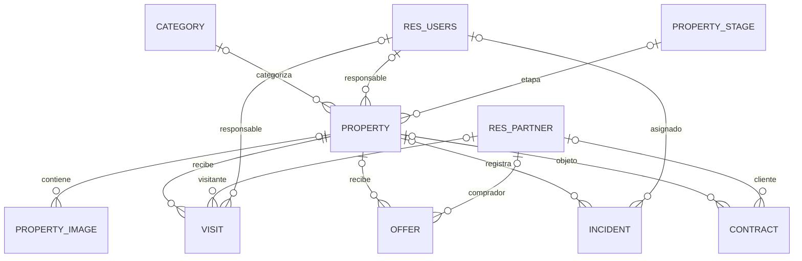

# Modelo de datos

## Alcance

Este documento describe los modelos Python del módulo `real_estate_RCNGC` y sus
relaciones actuales. Los modelos `res.users` y `res.partner` pertenecen a Odoo y
se muestran como entidades externas. Las cardinalidades reflejan si los campos
`Many2one` están marcados como obligatorios en el código; si no lo están, la
relación puede quedar vacía. Para el comportamiento funcional, consultar
[SPECIFICATION.md](SPECIFICATION.md); las reglas de negocio se mantienen en
[BUSINESS_RULES.md](BUSINESS_RULES.md).

## Diagrama de entidades y relaciones

Una relación `X o|--o{ Y` indica que cada registro Y puede tener cero o un X, y
que un X puede relacionarse con cero o muchos registros Y. En `PROPERTY ||--o{
VISIT`, cada visita debe tener una propiedad. Las relaciones entre oferta y
usuario/categoría no se dibujan como asociaciones propias: son campos
relacionados que se obtienen de la propiedad.

## Entidades del módulo

### `realestate.property` — Propiedad

- **Campos propios:** `name` (Char, obligatorio), `description` (Text), `price`
  (Float), `reference` (Char, único si se informa), `availability` (Boolean,
  valor inicial `True`) y `color` (Integer).
- **Relaciones:** `category_id` con `realestate.category`, `user_id` con
  `res.users` y `stage_id` con `realestate.property.stage`; las tres son
  opcionales. `user_id` toma por defecto el usuario actual. Tiene las colecciones
  inversas `image_ids`, `visit_ids`, `incident_ids` y `offer_ids`.
- **Campos calculados:** `next_visit_date` (Datetime almacenado), `visit_count` e
  `incident_count` (Integer no almacenados). La próxima visita se busca entre las
  visitas `scheduled`; los contadores cuentan los registros relacionados.

### `realestate.category` — Categoría

- **Campos:** `name` (Char, obligatorio) y `description` (Text).
- Una categoría puede clasificarse en muchas propiedades; la propiedad puede no
  tener categoría.

### `realestate.property.stage` — Etapa de propiedad

- **Campos:** `name` (Char, obligatorio) y `sequence` (Integer, valor inicial
  `10`).
- Una etapa puede utilizarse en muchas propiedades; la propiedad puede no tener
  etapa. No se cargan etapas predeterminadas desde el módulo.

### `realestate.property.image` — Imagen de propiedad

- **Campos:** `sequence` (Integer, valor inicial `10`), `name` (Char, obligatorio,
  valor inicial `Image `), `description` (Text) e `image` (Binary, obligatorio).
- `property_id` referencia opcionalmente una propiedad. Tiene `ondelete='cascade'`:
  eliminar la propiedad elimina sus imágenes.

### `realestate.visit` — Visita

- **Campos:** `date` (Datetime, valor inicial actual), `phone` (Char),
  `personal_email` (Char) y `state` (Selection: `draft`, `scheduled`, `done`,
  `canceled`; valor inicial `draft`).
- `property_id` referencia obligatoriamente una propiedad. `partner_id`
  (`res.partner`) y `user_id` (`res.users`) son opcionales.
- Al seleccionar el contacto, un `onchange` copia su teléfono y correo a los
  campos de la visita; no son campos relacionados almacenados automáticamente.

### `realestate.offer` — Oferta

- **Campos:** `sequence` (Integer), `amount` (Float), `date` (Datetime), `state`
  (Selection: `draft`, `sent`, `accepted`, `refused`; valor inicial `draft`),
  `color` (Integer) y `note` (Html).
- `property_id` (`realestate.property`) y `partner_id` (`res.partner`) son
  opcionales.
- `user_id` y `category_id` son campos `Many2one` relacionados con
  `property_id.user_id` y `property_id.category_id`. Son de solo lectura y están
  almacenados.
- El importe no puede ser negativo.

### `realestate.contract` — Contrato

- **Campos propios:** `name` (Char, opcional y único si se informa),
  `contract_type` (Selection: `sale`, `rent`; valor inicial `rent`),
  `start_date` (Date, valor inicial actual), `end_date` (Date), `rent` (Float),
  `deposit` (Float) y `state` (Selection: `draft`, `progress`, `done`,
  `cancelled`; valor inicial `draft`).
- `property_id` (`realestate.property`) y `partner_id` (`res.partner`) son
  opcionales.
- **Campos calculados:** `duration_days` (Integer almacenado), `days_to_end`,
  `days_in_progress` (Integer no almacenados) y `has_deposit` (Boolean
  almacenado). Al seleccionar una propiedad, un `onchange` inicializa `rent` con
  su precio.
- La fecha inicial no puede ser posterior a la fecha final.

### `realestate.property.incident` — Incidencia

- **Campos:** `sequence` (Integer, valor inicial `10`), `name` (Char,
  obligatorio), `description` (Text), `incident_priority` (Selection: `low`,
  `medium`, `high`, `critical`; valor inicial `medium`), `state` (Selection:
  `new`, `in_progress`, `resolved`, `closed`; valor inicial `new`) y
  `date_time_reported` (Datetime, valor inicial actual).
- `property_id` referencia opcionalmente una propiedad y usa
  `ondelete='cascade'`. `user_id` (`res.users`) es opcional y usa
  `ondelete='set null'`.

## Relaciones externas de Odoo

- `res.users`: usuario responsable de propiedades y visitas, y usuario asignado a
  incidencias. La oferta presenta el usuario responsable mediante un campo
  relacionado con su propiedad.
- `res.partner`: visitante de una visita, comprador de una oferta o cliente de un
  contrato.

## Herencia

Actualmente, las ocho clases del módulo definen modelos nuevos mediante `_name`.
No se utiliza `_inherit` ni `_inherits`. Las relaciones con `res.users` y
`res.partner` son asociaciones, no herencia. Si se añade herencia más adelante,
documentar aquí el modelo padre, el tipo de herencia de Odoo y los campos o
métodos ampliados.
